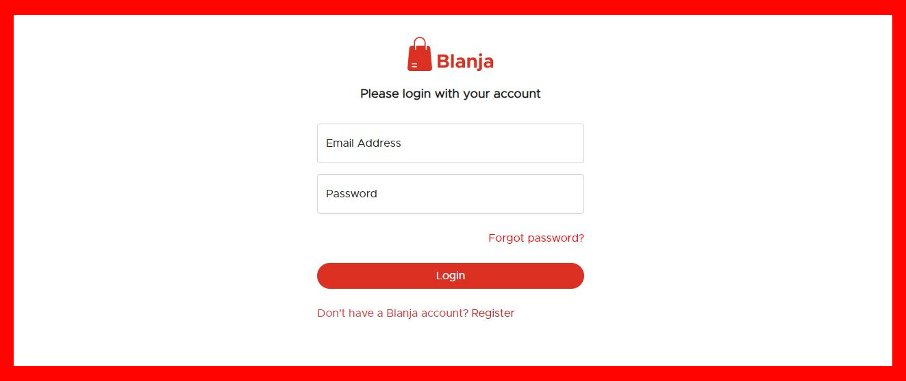
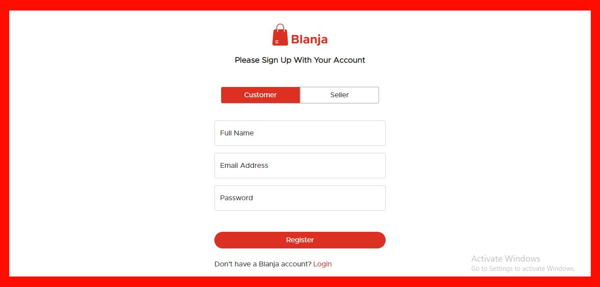
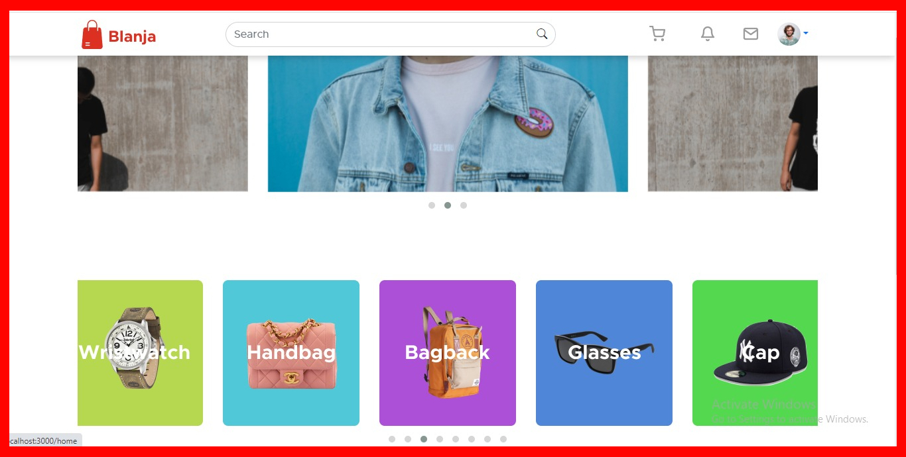
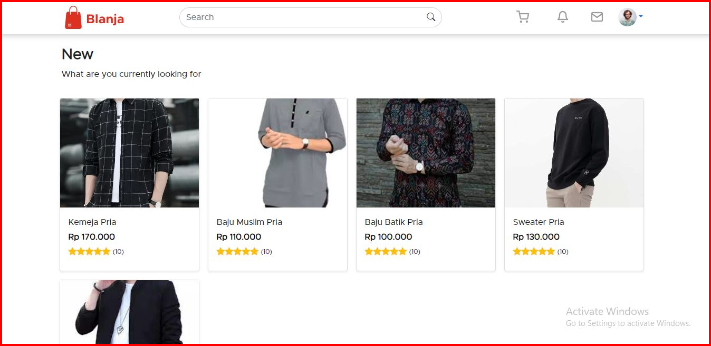
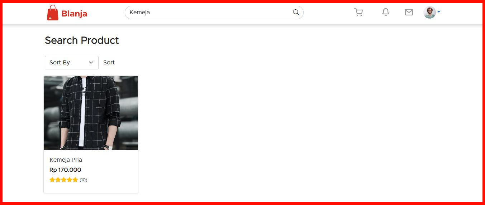
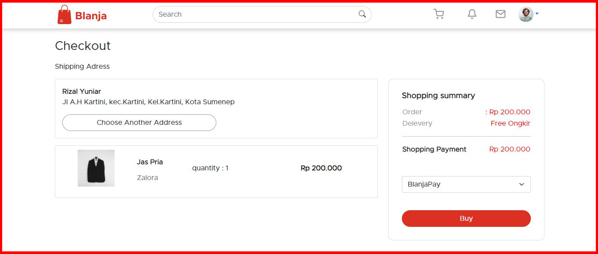
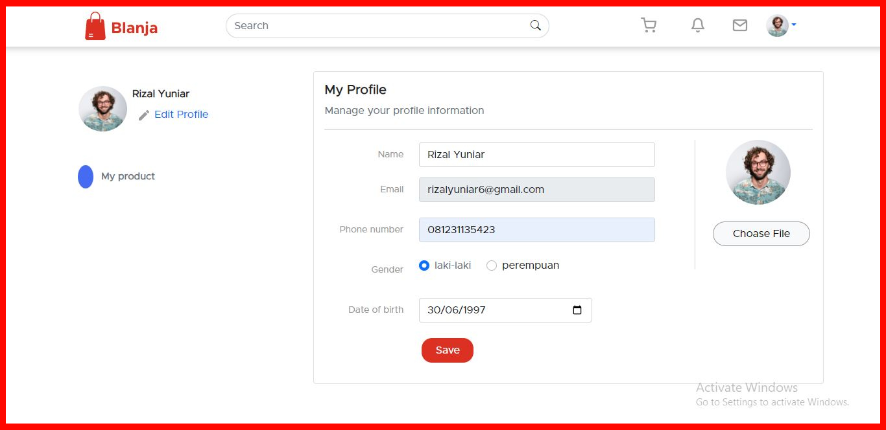
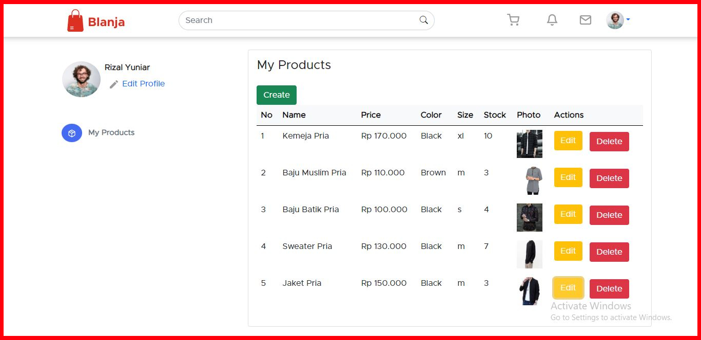
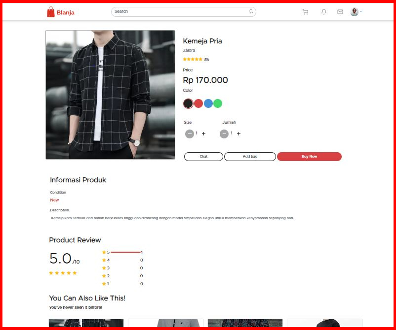

<br />
<p align="center">
<div align="center">
  
</div>
  <h3 align="center">Blanja App</h3>
  <p align="center">
    <a href="https://github.com/rizalyuniar/blanja-FE"><strong>Explore the docs »</strong></a>
    <br />
    <a href="https://blanjaa-fe.vercel.app/">View Demo</a>
    ·
    <a href="/">Report Bug</a>
    ·
    <a href="/">Request Feature</a>
  </p>
</p>


<!-- TABLE OF CONTENTS -->
## Table of Contents

- [Table of Contents](#table-of-contents)
- [About The Project](#about-the-project)
  - [Built With](#built-with)
  - [Requirements](#requirements)
- [Getting Started](#getting-started)
  - [Prerequisites](#prerequisites)
  - [Installation](#installation)
  - [Setup .env](#setup-env)
- [Screenshots](#screenshots)
- [Contributing](#contributing)
- [Related Project](#related-project)
- [Contact](#contact)


<!-- ABOUT THE PROJECT -->
## About The Project

Blanja is ecommerce with Restful API, this App handle manage access users (customers and sellers). This app can do create, read, update, and delete
products. Customers can do things like get a product list, product details, and product orders. Seller can add, update and delete products.

### Built With

[](https://react.dev/)
[](https://expressjs.com/)
[](https://www.postgresql.org/)
[](https://getbootstrap.com/)

### Requirements

[](/)

<!-- GETTING STARTED -->
## Getting Started

### Prerequisites

This is an example of how to list things you need to use the software and how to install them.

* [nodejs](https://nodejs.org/en/download/)

### Installation

- Clone This Front End Repo
```
git clone https://github.com/rizalyuniar/blanja-FE.git
```
- Go To Folder Repo
```
cd blanja-FE
```
- Install Module
```
npm install
```
- <a href="#setup-env">Setup .env</a>
- Type ` npm run start` To Start Website
- Type ` npm run production` To Start Production

### Setup .env
Create .env file in your root project folder.
```
REACT_BACKEND_API_URL = [BACKEND_URL]
```

<!-- ROADMAP -->
## Screenshots Pages

<table>
 <tr>
    <td></td>
    <td></td>
  </tr>
   <tr>
    <td>Login</td>
    <td>register</td>
  </tr>
   <tr>
    <td></td>
    <td> </td>
  </tr>
   <tr>
    <td>Landing Page</td>
    <td>New Product</td>
  </tr>

  <tr>
    <td></td>
    <td> </td>
  </tr>
   <tr>
    <td>Search Product</td>
    <td>Checkout Product</td>
  </tr>
  
   <tr>
    <td> </td>
    <td></td>
  </tr>
   <tr>
    <td>Profile</td>
    <td>List Product</td>
  </tr>
   <tr>
    <td> </td>
  </tr>
   <tr>
    <td>Detail Product</td>
  </tr>
</table>


<!-- CONTRIBUTING -->
## Contributing

Contributions are what make the open source community such an amazing place to be learn, inspire, and create. Any contributions you make are **greatly appreciated**.

1. Fork the Project
2. Create your Feature Branch (`git checkout -b feature/AmazingFeature`)
3. Commit your Changes (`git commit -m 'Add some AmazingFeature'`)
4. Push to the Branch (`git push origin feature/AmazingFeature`)
5. Open a Pull Request


## Related Project
:rocket: [`Backend Blanja`](https://github.com/rizalyuniar/blanja-BE)

:rocket: [`Frontend Blanja`](https://github.com/rizalyuniar/blanja-FE)

:rocket: [`Demo Blanja`](https://blanjaa-fe.vercel.app/)

<!-- CONTACT -->
## Contact

My Email : rizalyuniar123@gmail.com

Project Link: [https://github.com/rizalyuniar/blanja-FE/](https://github.com/rizalyuniar/blanja-FE/)
